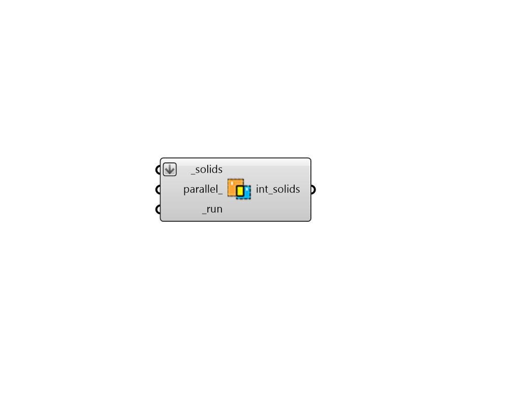

# Intersect Solids

 - [\[source code\]](https://github.com/ladybug-tools/honeybee-grasshopper-core/blob/master/honeybee_grasshopper_core/src//HB%20Intersect%20Solids.py)

Take a list of closed breps \(polysurfaces\) that you intend to turn into Rooms and split their Faces to ensure that there are matching faces between each of the adjacent rooms.

Matching faces and face areas betweem adjacent rooms are necessary to ensure that the conductive heat flow calculation occurs correctly across the face in an energy simulation.

## Inputs

* **solids \[Required\]**

  A list of closed Rhino breps \(polysurfaces\) that you intend to turn into Rooms that do not have perfectly matching surfaces between adjacent Faces \(this matching is needed to contruct a correct multi-room energy model\). 

* **parallel**

  Set to "True" to run the intersection calculation in parallel, which can greatly increase the speed of calculation but may not be desired when other simulations are running on your machine. If False, the calculation will be run on a single core. Default: False. 

* **run \[Required\]**

  Set to True to run the component. 

## Outputs

* **int\_solids**

  The same input closed breps that have had their component faces split by adjacent polysurfaces to have matching surfaces between adjacent breps.  It is recommended that you bake this output and check it in Rhino before turning the breps into honeybee Rooms. 

