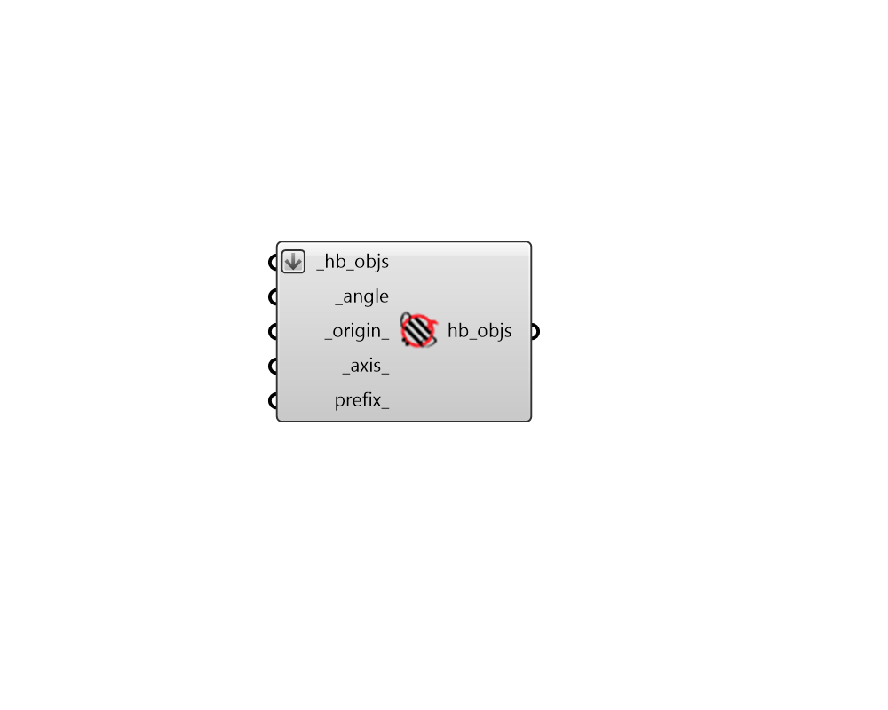

# Rotate

 - [\[source code\]](https://github.com/ladybug-tools/honeybee-grasshopper-core/blob/master/honeybee_grasshopper_core/src//HB%20Rotate.py)

Rotate any Honeybee geometry object or a Model by an angle.

## Inputs

* **hb\_objs \[Required\]**

  Any Honeybee geometry object \(eg. Room, Face, Aperture, Door or Shade\) to be rotated by an angle. This can also be a Honeybee Model object to be rotated. 

* **angle \[Required\]**

  An angle for rotation in degrees. 

* **origin**

  A Point3D for the origin around which the object will be rotated. If None,  it will be rotated from each object's center point unless the input object is a Model, in which case, it will be rotated from the world origin \(0, 0, 0\). 

* **axis**

  A Vector3D axis representing the axis of rotation. If None, the axis will be a Z-vector \(0, 0, 1\) and the object will be rotated within the XY plane. 

* **prefix**

  Optional text string that will be inserted at the start of the identifiers and display names of all transformed objects, their child objects, and their adjacent Surface boundary condition objects. This is particularly useful in workflows where you duplicate and edit a starting object and then want to combine it with the original object into one Model \(like making a model of repeated rooms\) since all objects within a Model must have unique identifiers. It is recommended that this prefix be short to avoid maxing out the 100 allowable characters for honeybee identifiers. If None, no prefix will be added to the input objects and all identifiers and display names will remain the same. Default: None. 

## Outputs

* **hb\_objs**

  The input \_hb\_objs that has been rotated by the input angle. 

