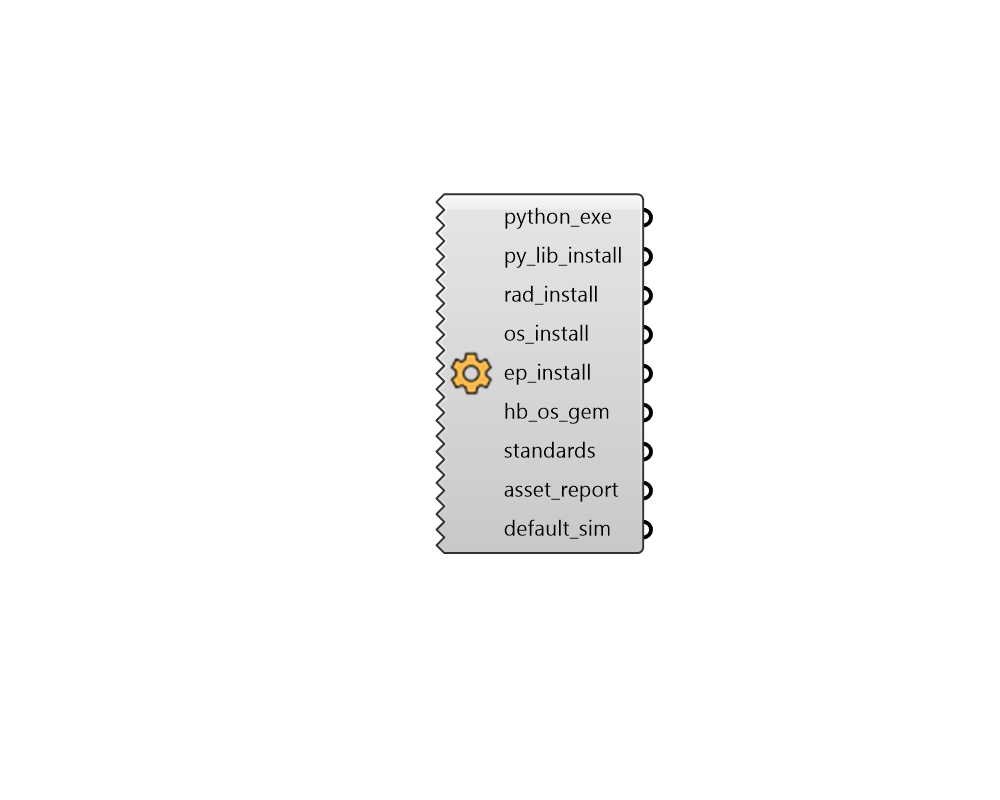

# Config

 - [\[source code\]](https://github.com/ladybug-tools/honeybee-grasshopper-core/blob/master/honeybee_grasshopper_core/src//HB%20Config.py)

Check the local configuration of the engines and data sets used by the honeybee plugin. This is useful for verifying that everything has been installed correctly and that the engines are configured as expected.

## Inputs

## Outputs

* **python\_exe**

  The path to the Python executable to be used for Ladybug Tools CLI calls. 

* **py\_lib\_install**

  The path to where the Ladybug Tools Python packages are installed. 

* **rad\_install**

  The path to Radiance installation folder if it exists. 

* **os\_install**

  The path to OpenStudio installation folder if it exists. 

* **ep\_install**

  The path to EnergyPlus installation folder if it exists. 

* **hb\_os\_gem**

  The path to the honeybee\_openstudio\_gem if it exists. This gem contains libraries and measures for translating between Honeybee JSON schema and OpenStudio Model schema \(OSM\). 

* **standards**

  The path to the library of standards if it exists. This library contains the default Modifiers, ModifierSets, Constructions, ConstructionSets, Schedules, and ProgramTypes. It can be extended by dropping IDF or Honeybee JOSN files into the appropriate sub-folder. 

* **asset\_report**

  A report of all the assets that have been loaded from the standards library. 

* **default\_sim**

  The path to the default simulation folder \(where simulation files are written if not specified by the user.\). 

