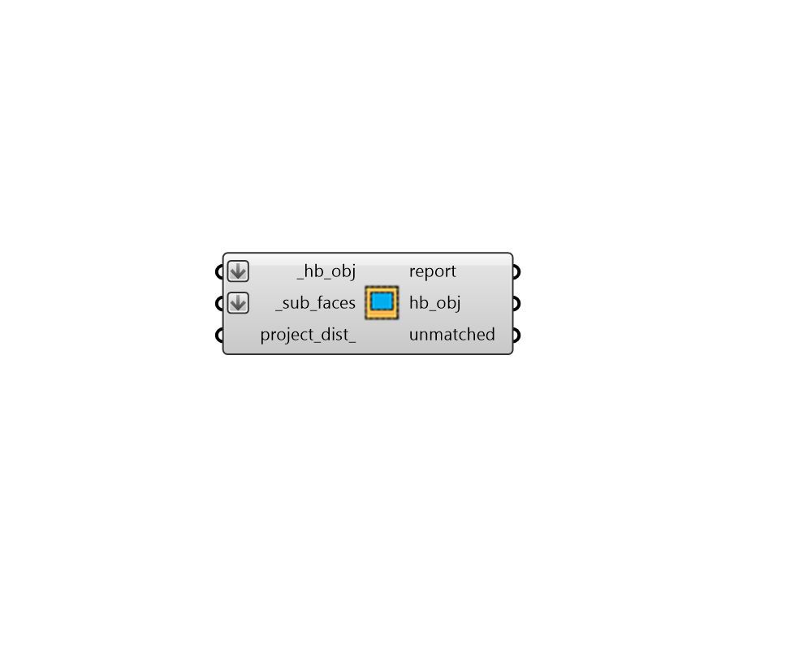

## Add Subface

 - [[source code]](https://github.com/ladybug-tools/honeybee-grasshopper-core/blob/master/honeybee_grasshopper_core/src//HB%20Add%20Subface.py)

Add a Honeybee Aperture or Door to a parent Face or Room. 

#### Inputs
* ##### hb_obj [Required]
A Honeybee Face or a Room to which the _sub_faces should be added. This can also be an entire Honeybee Model in which case Apertures will be added to all FAces of the Model (including both Room Faces and orphaned Faces). 
* ##### sub_faces [Required]
A list of Honeybee Apertures and/or Doors that will be added to the input _hb_obj. 
* ##### project_dist 
An optional number to be used to project the Aperture/Door geometry onto parent Faces. If specified, then Apertures within this distance of the parent Face will be projected and added. Otherwise, Apertures/Doors will only be added if they are coplanar and fully bounded by a parent Face. 

#### Outputs
* ##### report
Reports, errors, warnings, etc. 
* ##### hb_obj
The input Honeybee Face or a Room with the input _sub_faces added to it. 
* ##### unmatched
A list of any Apertures or Doors that could not be matched and assigned to a parent Face. 