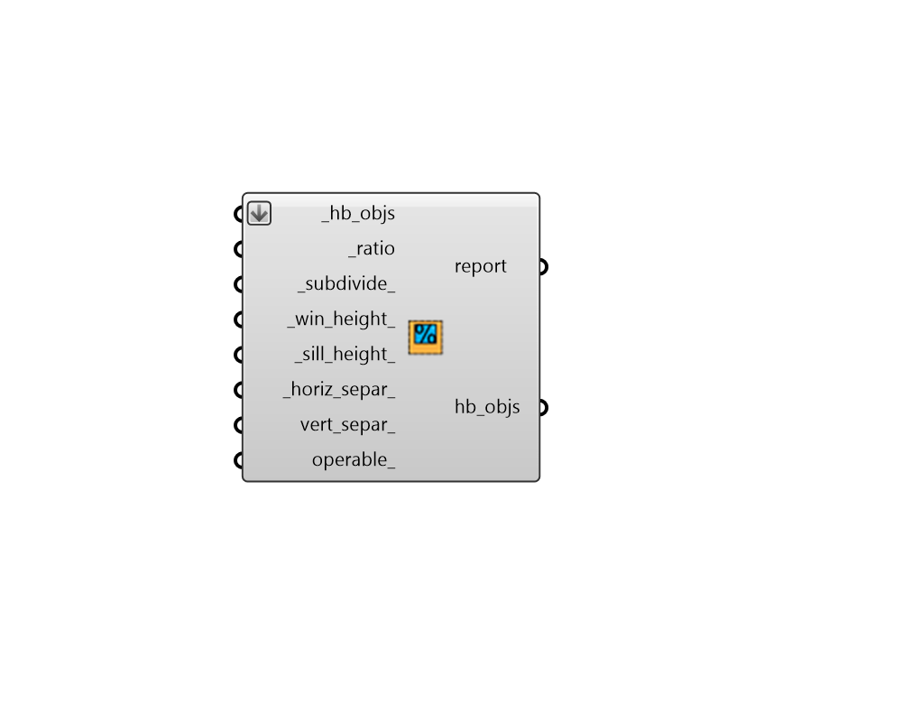

## Apertures by Ratio

 - [[source code]](https://github.com/ladybug-tools/honeybee-grasshopper-core/blob/master/honeybee_grasshopper_core/src//HB%20Apertures%20by%20Ratio.py)

Add apertures to a Honeybee Face or Room given a ratio of aperture area to face area. 

Note that this component will only add Apertures to Faces that are Walls and have an Outdoors boundary condition. 

#### Inputs
* ##### hb_objs [Required]
A list of honeybee Rooms or Faces to which Apertures will be added based on the inputs. This can also be an entire honeybee Model for which all Rooms will have Apertures assigned. 
* ##### ratio [Required]
A number between 0 and 0.95 for the ratio between the area of the apertures and the area of the parent face. If an array of values are input here, different ratios will be assigned based on cardinal direction, starting with north and moving clockwise. 
* ##### subdivide 
Boolean to note whether to generate only one or two windows for each Face (False) or to generate a series of repeating rectangular windows using the other inputs below (True). The latter is often more realistic and distributes the windows across the parent Face for better daylight but the former is likely more useful when modeling building energy use since energy use doesn't change signifcantly while the glazing ratio remains constant. (Default: True). 
Note that this input can also be the integer -1 to completely turn off all spltting of the base face into underling rectangles. By default, a False value here will result in two windows generated for and input pentagonal gabled geometry - one rectangle and one triangle. This is better for engines like EnergyPlus that cannot model windows with more than 4 vertices. However, if a single pentagonal window is desired for such a shape, setting this input to -1 will produce such a result. 
* ##### win_height 
A number for the target height of the output apertures. Note that, if the ratio is too large for the height, the ratio will take precedence and the actual aperture height will be larger than this value. If an array of values are input here, different heights will be assigned based on cardinal direction, starting with north and moving clockwise. (Default: 2 meters). 
* ##### sill_height 
A number for the target height above the bottom edge of the face to start the apertures. Note that, if the ratio is too large for the height, the ratio will take precedence and the sill_height will be smaller than this value. If an array of values are input here, different heights will be assigned based on cardinal direction, starting with north and moving clockwise. (Default: 0.8 meters). 
* ##### horiz_separ 
A number for the horizontal separation between individual aperture centerlines.  If this number is larger than the parent face's length, only one aperture will be produced. If an array of values are input here, different separation distances will be assigned based on cardinal direction, starting with north and moving clockwise. (Default: 3 meters). 
* ##### vert_separ 
An optional number to create a single vertical separation between top and bottom apertures. If an array of values are input here, different separation distances will be assigned based on cardinal direction, starting with north and moving clockwise. (Default: 0). 
* ##### operable 
An optional boolean to note whether the generated Apertures can be opened for ventilation. If an array of booleans are input here, different operable properties will be assigned based on cardinal direction, starting with north and moving clockwise. (Default: False). 

#### Outputs
* ##### report
Reports, errors, warnings, etc. 
* ##### hb_objs
The input Honeybee Face, Room or Model with Apertures generated from the input parameters. 