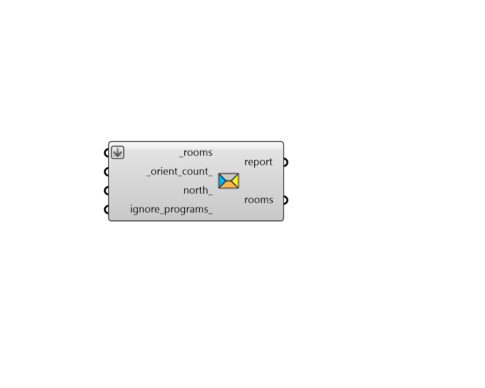

## Automatic Zoning

 - [[source code]](https://github.com/ladybug-tools/honeybee-grasshopper-core/blob/master/honeybee_grasshopper_core/src//HB%20Automatic%20Zoning.py)

Automatically group rooms with similar properties and use the groups to assign zones. 

Relevant properties that are used to group Room2Ds into zones include story, orientation, and (optionally) energy programs. 

Rooms that share the same zone have a common thermostat in energy simulation. This can often significnatly reduce simulation time without greatly impacting energy use results. 

#### Inputs
* ##### rooms [Required]
A list of honeybee honeybee Rooms to which zones will be assigned. This can also be an entire Honeybee Model. Note that these rooms should have adjacencies solved in order for them to be correctly zoned based on orientation. 
* ##### orient_count 
A positive integer to set the number of orientation groups to use for zoning. For example, setting this to 4 will result in zones being established based on the four orientations (North, East, South, West). (Default: 8). 
* ##### north 
A number between 0 and 360 to set the clockwise north direction in degrees. This can also be a vector to set the North. Default is 0 for the world Y-axis. 
* ##### ignore_programs 
Boolean for whether the Programs assigned to the Rooms should be ignored during the automatic zoning process in which case rooms with different programs can appear in the same zone. (Default: False). 

#### Outputs
* ##### report
Errors, warnings, etc. 
* ##### rooms
The input Rooms (or Model) with zones assigned based on the input criteria. 