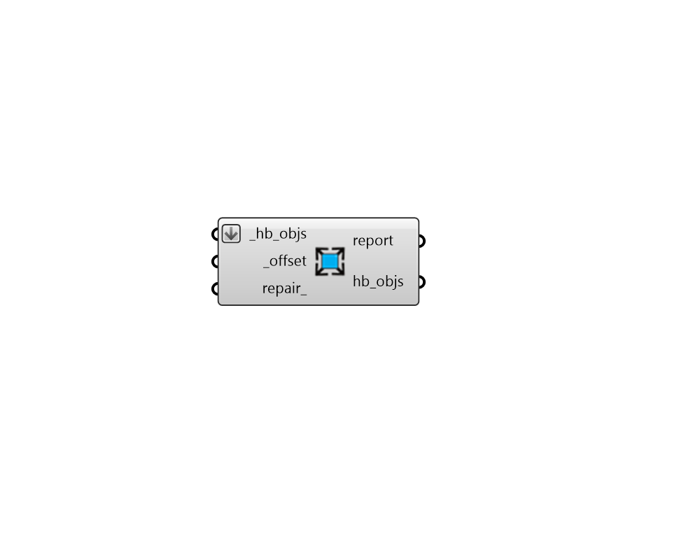

## Offset Aperture Edges

 - [[source code]](https://github.com/ladybug-tools/honeybee-grasshopper-core/blob/master/honeybee_grasshopper_core/src//HB%20Offset%20Aperture%20Edges.py)

Offset the edges of all Apertures of a Honeybee Room or Face by a certain distance. 

This is useful for translating between interfaces that expect the window frame to be included within or excluded from the geometry of the Aperture. For example, EnergyPlus expects Aperture geometry to be for only the glass portion of the window while IES-VE expects the Aperture geometry to include the frame. 

Note that this component also has usefulness to simply repair cases where Apertures extend pas their parent Face or overlap with one another. In this situation, the offset input can be set to zero and the repair_ boolean set to True to only run the repair operation. 

#### Inputs
* ##### hb_objs [Required]
A list of honeybee Rooms or Faces for which Apertures will have their edges offset. This can also be an entire honeybee Model for which all Rooms will have Apertures offset. 
* ##### offset [Required]
A number for the distance with which the edges of each Aperture will be offset from the original geometry. Positive values will offset the geometry outwards and negative values will offset the geometries inwards. 
* ##### repair 
A bool to note whether invalid Apertures and Doors should be fixed after performing the initial offset operation. This repair process involves two steps. First, sub-faces that extend past their parent Face are trimmed with the parent and will have their edges offset towards the inside of the Face. Second, any sub-faces that overlap or touch one another will be unioned into a single Aperture or Door. (Default: False). 

#### Outputs
* ##### report
Reports, errors, warnings, etc. 
* ##### hb_objs
The input Honeybee Face, Room or Model with Apertures offset. 