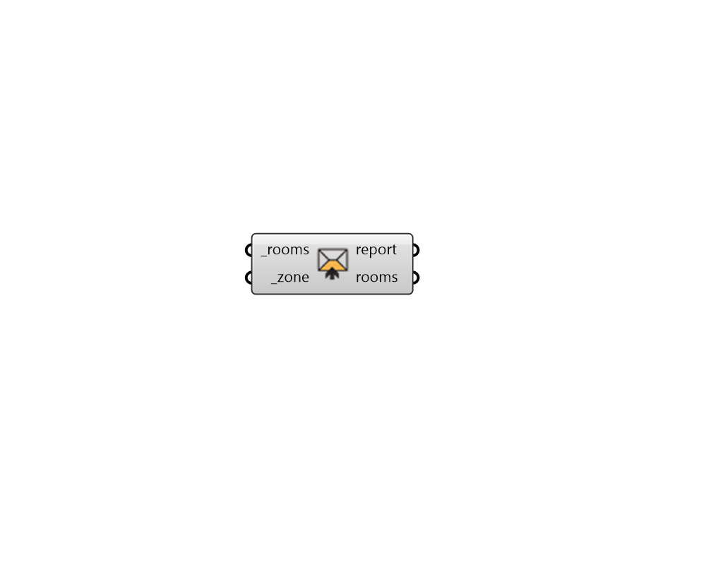

## Set Zone

 - [[source code]](https://github.com/ladybug-tools/honeybee-grasshopper-core/blob/master/honeybee_grasshopper_core/src//HB%20Set%20Zone.py)

Set text for the zone identifier for honeybee Rooms. 

Rooms sharing the same zone identifier are considered part of the same zone in a Model. If a zone identifier has not been specified for a given Room, it will be the same as the Room identifier. 

#### Inputs
* ##### rooms [Required]
Honeybee Rooms to which the input _zone identifier should be assigned. 
* ##### zone [Required]
Text for the zone identifier to which the rooms belong. 

#### Outputs
* ##### report
... 
* ##### rooms
The input Rooms with their zones set. 