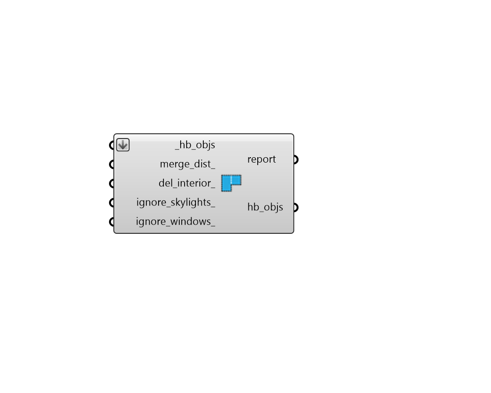

## Simplify Apertures

 - [[source code]](https://github.com/ladybug-tools/honeybee-grasshopper-core/blob/master/honeybee_grasshopper_core/src//HB%20Simplify%20Apertures.py)

Simplify the Apertures assigned to Honeybee Rooms or Faces to be as few as possible while still maintaining approximately the same overall Aperture area. 

By default, this component will only simplify Apertures in convex Faces by  reducing them to a ratio represented with one or two clean Apertures. For models without many concave Faces, this process usually produces a fast-simulating result that matches the original window area exactly. However, this operation will also change the placement of Apertures within a Face, which may make it unsuitable for modeling the impact of Shades on Apertures or for evaluating daylight. 

For cases with concave Faces (which is typical for Roofs/Skylights) or when it is desirable to keep Apertures in the same location within the parent Face, the Apertures can be simplified by specifying a merge_dist_, which will join together Apertures in close proximity to one another rather than reducing them to a ratio. 

#### Inputs
* ##### hb_objs [Required]
A list of honeybee Rooms or Faces to which Apertures will be simplified. This can also be an entire honeybee Model for which all Rooms will have Apertures simplified. 
* ##### merge_dist 
Distance between Apertures and/or Doors at which point they will be merged into a single Aperture. When unspecified, only Apertures within convex faces will be reduced to a ratio. This will match the original Aperture area exactly but it will change the placement of Apertures within the Face, which can make it unsuitable for modeling the impact of Shades on Apertures. When a value is specified here, concave Faces will be addressed and Apertures will remain where they are in the parent Face. The overall Aperture area may be a little larger thanks to merging across gaps that are less than or equal to the value specified but the result will be suitable for evaluating the impact of Shades or simulating daylight. 
* ##### del_interior 
Boolean to note whether the simplification process should remove all interior Apertures with a Surface boundary condition (True) or an attempt will be made to reset adjacencies after Apertures have been simplified/rebuilt (False). (Default: False). 
* ##### ignore_skylights 
Boolean to note whether the simplification process should ignore all skylights and leave them as they are. (Default: False). 
* ##### ignore_windows 
Boolean to note whether the simplification process should ignore all windows and leave them as they are. (Default: False). 

#### Outputs
* ##### report
Reports, errors, warnings, etc. 
* ##### hb_objs
The input Honeybee Face, Room or Model with Apertures simplified. 